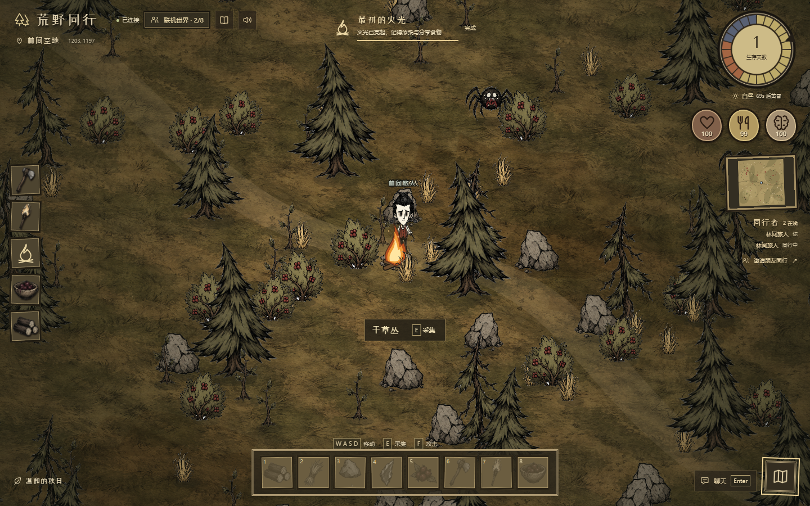

# 荒野同行 · Wildwood Together

中文浏览器多人合作生存游戏，回应「饥荒联机网页版」的玩法意图。**原创独立实现，不是《饥荒联机版》的官方移植，不使用其专有素材，不兼容原作服务器。**



## 运行

需要 Node.js 22.12+（本机使用 22.22.2）与 npm。

```sh
npm ci
npm run dev
```

打开 **http://localhost:3000** 即可直接进入默认世界。开发模式提供 Vite 热更新及同进程 WebSocket 服务。

生产运行：

```sh
npm run build
npm start
```

`PORT` 默认 `3000`，`HOST` 默认 `0.0.0.0`。例如 Bash：

```sh
HOST=127.0.0.1 PORT=8080 npm start
```

PowerShell：

```powershell
$env:PORT=8080
npm start
```

### 真实联机

- 两个浏览器／两台设备打开同一服务器地址，在「联机世界」输入相同世界代码。
- 房间码支持 4–12 位字母或数字；不存在的代码会建立世界。「创建全新世界」生成随机代码。
- 「邀请朋友同行」复制含 `?room=世界代码` 的链接。浏览器限制剪贴板时，可复制地址栏链接。
- 局域网朋友使用 `http://服务器局域网IP:3000`，而不是 `localhost`。需允许防火墙入站 TCP 3000。
- 跨网络访问需要你自己的可访问服务器／域名，推荐 HTTPS 反向代理，并转发 `/ws` 的 WebSocket Upgrade。HTTPS 页面自动使用 WSS。
- 每个世界最多 8 人，最多 100 个世界。多人位置、资源存量、营火、怪物、时间和聊天由同一服务端同步；不是本地假人。

## 操作

| 动作 | 桌面 | 手机／触屏 |
|---|---|---|
| 移动 | WASD／方向键，或点击地面 | 点击地面／左下方向键 |
| 采集 | 靠近资源按 E，或点击资源自动走近 | 点击资源／右下手形按钮 |
| 制作 | 左栏点击配方 | 底栏「制作」打开配方 |
| 食用／火把 | 点击背包，或快捷键 1–8 | 「行囊」打开背包，点击物品 |
| 攻击 | F | 右下斧形按钮 |
| 聊天 | Enter／聊天按钮 | 聊天按钮 |
| 地图 | M／右上地图按钮 | 右上地图按钮 |
| 生存指南 | 顶栏书本按钮 | 顶栏书本按钮 |

## 生存规则

- 2400 × 2400 世界包含树木、树枝、草丛、岩石、浆果和爬虫。空地周围有保证可达的初始资源。
- 岩石同时产出石头和燧石；有石斧时树木采集翻倍。
- 2 木材 + 2 燧石 → 石斧；2 干草 + 1 木材 → 火把；3 木材 + 3 干草 → 营火。
- 1 浆果 → 烤浆果、1 木材 → 添柴，均需在燃烧的营火旁操作。
- 原浆果恢复 18 饥饿／3 生命；烤浆果恢复 28 饥饿／8 生命，上限 100。
- 一昼夜 180 秒：白昼 105 秒、黄昏 40 秒、黑夜 35 秒。饥饿每秒下降 0.13；饥饿归零开始掉血。
- 黑夜没有光照时每秒失去 1.8 生命与 1.1 理智。营火照亮 185 世界单位内的所有玩家，燃烧 150 秒；添柴延长 60 秒。火把使用后持续 90 秒。
- 爬虫白天在 210 单位、夜间在 650 单位内追击，靠近营火会退避。空手伤害 15，石斧伤害 30；击败奖励 2 浆果。
- 资源采尽后 90 秒再生，击败的爬虫 150 秒再生。动作有服务端冷却，距离和材料均由服务器验证。
- 倒下后点击「重新出发」，在初始空地恢复生命。携带物品保留，这是本游戏明确的规则，不模拟原作掉落系统。

## 状态与部署边界

世界保存在 **Node 进程内存**，无在线玩家时停止游戏时间。空世界 30 分钟后清理，服务器重启清空世界。断线会移除角色；自动重连为新的旅人，**不会恢复原背包与位置**，页面明确提示。不宣称持久存档或原作完整内容。

服务器是唯一游戏规则权威，浏览器不能指定自己的生命、背包或直接瞬移。网络输入限制 4 KB，每连接每秒最多处理 40 条消息，聊天限频，所有玩家／聊天文本按纯文本渲染。该项目没有账号、私密房间密码、存档数据库或跨进程分布式世界；房间代码是邀请方式，不是权限凭证。公开部署应由反向代理提供 TLS、连接／IP 限流和访问控制。不要直接将开发模式暴露公网。

## 验证

```sh
npm run validate
```

完整执行 ESLint、13 项单元／实际 WebSocket 网络测试、Vite 生产构建及 5 项 Playwright 浏览器测试。JS 项目不设置虚假的 TypeScript 类型检查；ESLint 负责未定义变量及代码错误检查，测试验证运行规则。

浏览器测试默认使用本机 Chrome；无系统 Chrome 时先 `npx playwright install chromium`。也可设置 `PLAYWRIGHT_EXECUTABLE_PATH`。测试占用 3140 和 3137 端口；请先停止其他占用进程。联机测试实际等待昼夜转换，因此完整验证通常约 3 分钟。

- `tests/world.test.js`：制作、采集、再生、移动边界、昼夜、饥饿、死亡、战斗、房间、聊天。
- `tests/network.test.js`：生产 WebSocket，8 人上限、房间隔离、错误房间保留旧连接、非法输入和超大载荷。
- `tests/game.spec.js`：两个独立浏览器上下文加入同一房间，真实操作移动／采集／营火／聊天／断开，并进入黑夜检验共同庇护；手机操作；创建世界与 XSS 防护；断网重连。
- `evidence/`：桌面、手机、夜间截图、多人证据 JSON、浏览器测试报告及验证日志。

## 文件

```
server/index.js     HTTP / WebSocket / 房间生命周期
server/world.js     权威世界规则和配方（无浏览器依赖）
src/main.js         网络客户端、DOM 状态、输入与交互
src/renderer.js     等距 Canvas 世界、动态光照、地图与时钟
src/icons.js        原创统一线性 SVG 图标
src/style.css      桌面和触屏布局
public/fonts/      自托管字体及授权
```

字体 ZCOOL XiaoWei 使用 SIL Open Font License 1.1，授权见 `public/fonts/OFL.txt`。原字体来自 Google Fonts 项目，本地转换为 WOFF2，保留全字符集。游戏对象采用本地生成并提取的透明手绘 PNG，美术来源与生成提示见 `public/art/PROVENANCE.md`；运行不依赖外部图像服务。未提取原作贴图或源码，不冒充官方移植。

## 本轮画面重做

撤掉网页式大侧栏，改为全屏手绘森林、边缘制作栏、右上日夜与生存 HUD、底部绘制物品行囊。人物分关节走路，采集、攻击、受击反馈由服务器动作时间戳触发；对象点击按透明精灵的真实墨迹判定。`evidence/redesign/` 包含生成提示、透明底检查、动作录屏、性能采样与原作截图比对。视觉是否满足用户要求仍需用户确认，不以测试通过宣称与原作完全一致。

## 合集内使用

本目录已接入父目录 npm workspaces，安装与锁文件由父目录统一管理。请优先从父目录运行 `npm ci`、`npm run check`、`npm run preview`。合集中地址为 `/wildwood-together/`，WebSocket 自动连接相同前缀的 `ws` 路径；运行、代理与静态部署限制详见 `INTEGRATION.md`。
